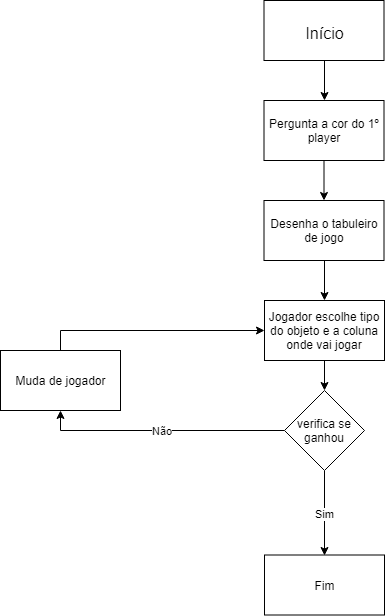

# Simplexity
#### Grupo e trabalho realizado

* ##### Rodrigo Garcia Nº21704304
* ##### António Louro Nº21702439
* ##### Paulo Ramires Nº21701507

* ##### [Repositório Git](https://github.com/Paulow98/Simplexity)
* ##### O Paulo Ramires fez os ficheiros 
* ##### O António Louro fez os ficheiros 
* ##### O Rodrigo Garcia fez os ficheiros Program.cs, Gamemanager.cs, Player.cs e Relatório em markdown 

#### Descrição da solução
Board.cs - Board contem um array de Column, e usa as funções Draw para desenhar o jogo, CheckHorizontal para verifica se alguém ganhou na horizontal e CheckDiagonal para verificar se houve uma vitoria na diagonal.
Column.cs -Column é uma classe que tem um stack de pieces, contendo a função Check para verificar se alguém ganhou na vertical
GameManager.cs - GameManager serve para fazer o ciclo do jogo
Piece.cs - Piece é a classe que contem todos os atributos que estão ligados a uma peça: Cor e Forma
Player.cs - Player é a classe que controla todas as ações do jogo
Program.cs - Program usa os outros ficheiros para iniciar o jogo

###### Fluxograma

#### Conclusão 
Apesar de ter havido algumas dificuldades por parte de certos membros do grupo conseguimos concluir este projeto e assim melhorar as nossas capacidades de programação, mas tambem o nosso trabalho em equipa e o uso da ferramenta Git. 

Nota: Os commits foram poucos e com muito conteúdo pois estivemos a trabalhar juntos e só os fizemos quando estavam a funcionar mais ou menos.

#### Referencias

**Curso:** Licenciatura em Aplicações Multimédia e Videojogos
**Instituição:** Universidade Lusófona de Humanidades e Tecnologias

